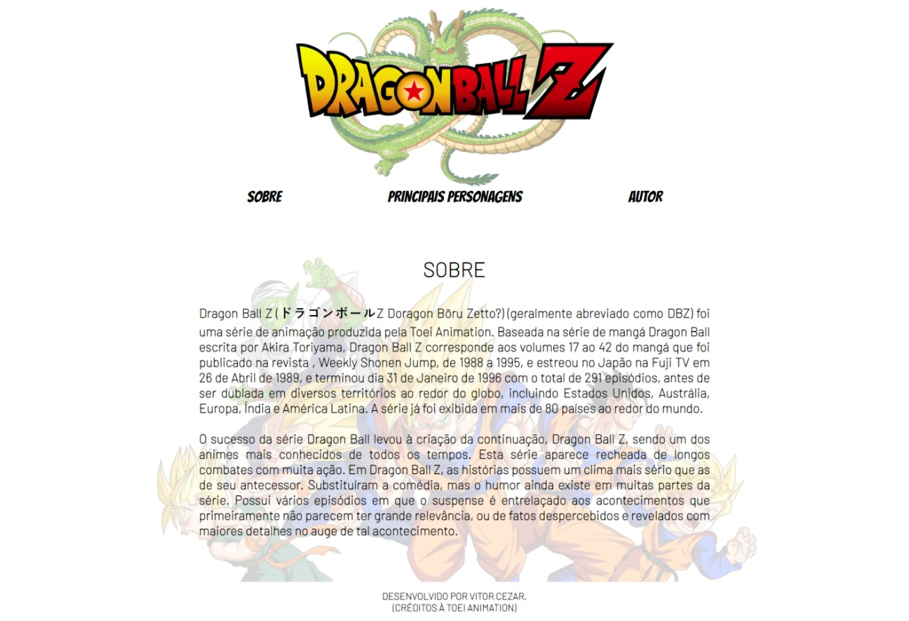
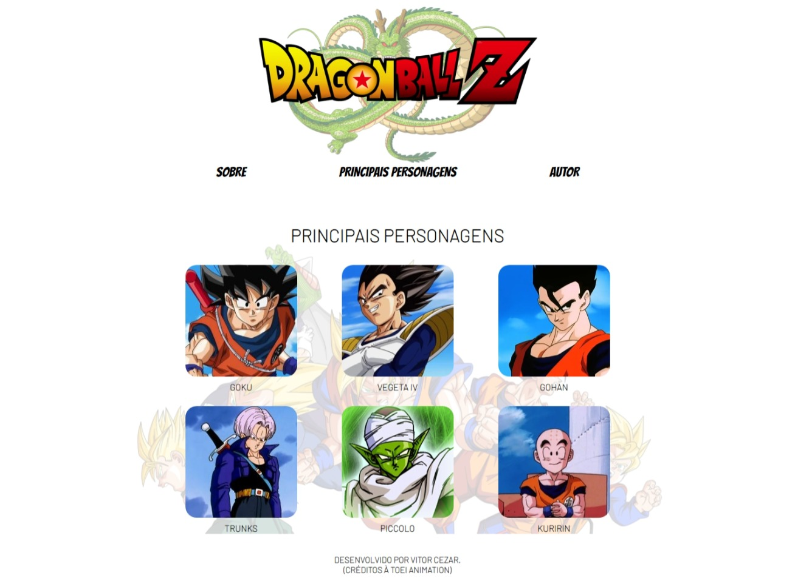
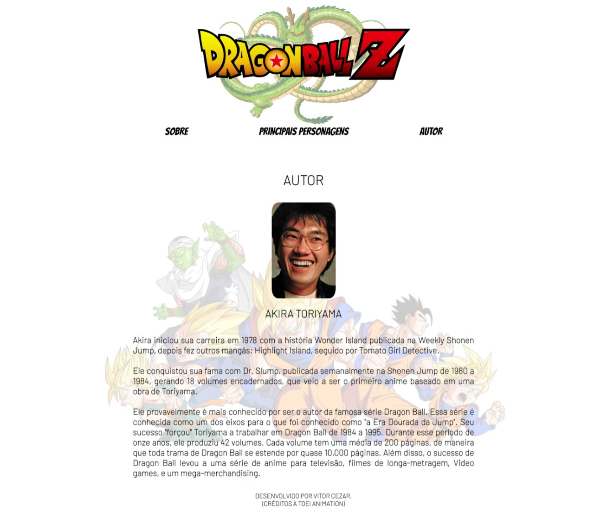

# 💻 Dragon Ball Fansite

---

## 🗒️ Sobre o projeto

Este é um simples site sobre Dragon Ball feito para praticar ReactJS. 
O site contém algumas informações sobre o anime e o autor, além de conter os principais personagens. 

Foi praticado a criação de components, screens, navegação sem reload e rotas usando useState, useEffect, Switch, Route, Link etc...

---

## 🛠 Tecnologias

### Frontend:

-   HTML
-   CSS
-   JavaScript
-   ReactJS

---

## 🎨 Screens

### Web

  

  

  

